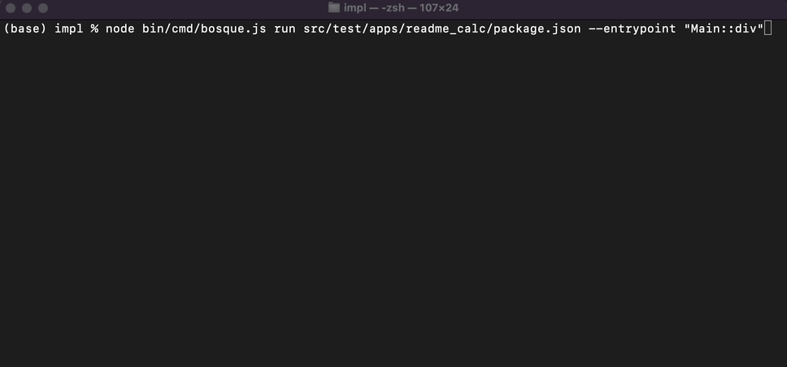

# Bosque Programming Language

[](https://github.com/Microsoft/BosqueLanguage/blob/master/LICENSE.txt)
[](#contribute)
[](https://github.com/microsoft/BosqueLanguage/actions) 


# The Bosque Project

The Bosque Programming Language project is a ground up language & tooling co-design effort focused on is investigating the theoretical and the practical implications of:

1. Explicitly designing a code intermediate representation language (bytecode) that enables deep automated code reasoning and the deployment of next-generation development tools, compilers, and runtime systems.
2. Leveraging the power of the intermediate representation to provide a programming language that is both easily accessible to modern developers and that provides a rich set of useful language features for developing high reliability & high performance applications.
3. Taking a cloud-development first perspective on programming to address emerging challenges as we move into a distributed cloud development model based around serverless and microservice architectures.

The **_Bosque Language_** is a novel hybrid of functional programming language semantics and an ergonomic block & assignment-based syntax. This allows developers to organize code into familiar/natural blocks and compositions while, simultaneously, benefiting from the correctness and simplicity of a functional programming model (see code examples below). The language also provides a range of ergonomic features for writing high reliability code, such as Typed Strings, unit typedecls for primitives, and first-class assertions/pre-post conditions/invariants.

The **_Bosque Testing Framework_** provides a built-in unit testing system, a powerful new SMT powered property-based testing system, and the ability to symbolically search for errors that can be triggered by user inputs in the entrypoints to the program (see the `bosque` command section below). These tests and checks can find compact debuggable inputs that trigger and error or failing test and, in many cases, can also prove that there will never be a case with a “small repro” that triggers the error! 

The **_Bosque Runtime_** is a novel _pathology free_ design that focuses on predictable latency, pauses, and 99th percentile behavior. This starts with a new garbage collector that is guaranteed to never need a stop-the-world collection, that only uses live-heap + a small constant in memory to run, and (will eventually) supports background external defragmentation! Beyond the GC behavior the runtime design excludes pathological regex behavior, dynamic execution bailout overload, and catastrophic amortized operation behaviors such as repeated rehashing (instead using slower but stable log time persistent structures). 

The **_Bosque API Types_** provide a way to specify an application interface in a clean manner that is independent of the specifics of the Bosque type system. This enables the auto-generation of input validation and encoding logic. We currently support a universal JSON encoding but more efficient representations are possible. This design ensures that Bosque APIs can easily be integrated into polyglot systems (e.g. microservice architectures) or integrated into existing codebases (e.g. Node.js or C++). 

The **_Bosque Package Manager_** (see the `bosque` command section) provides a centralized way to organize, test, and build an application – either as a standalone command or to integrate into other applications via JSON APIs. This manager is designed to take advantage of the checking capabilities of Bosque and will enable developers to (1) test against imported code using auto-generated mocks and (2) check that package updates do not (intentionally or maliciously) change the package behavior, introduce new data outputs, or expose sensitive data to unintended outputs!


# Documentation

Small samples of code and unique Bosque tooling are below in the [Code Snippets](#Code-Snippets) and [Tooling](#Tooling) sections. A rundown of notable and/or unique features in the Bosque language is provided in the [language overview section 0](docs/language/overview.md#0-Highlight-Features).

Detailed Documentation, Tutorials, and Technical Information:
* [Language Docs](docs/language/overview.md)
* [Library Docs](docs/libraries/overview.md)
* Tutorials - _Coming Eventually!_
* [Technical Papers](docs/papers/publist.md)
* [Contribution guidelines](CONTRIBUTING.md)

## Code Snippets

**Add 2 numbers:**

```none
function add2(x: Nat, y: Nat): Nat {
    return x + y;
}

add2(2, 3)     //5
add2(x=2, y=3) //5
add2(y=2, 5)   //7
```

**All positive check using rest parameters and lambda:**

```none
function allPositive(...args: List<Int>): Bool {
    return args.allOf(fn(x) => x >= 0i);
}

allPositive(1, 3, 4) //true
```

**Tuples and Records:**

```none
function doit(tup: [Int, Bool], rec: {f: String, g: Int}): Int {
    return tup.0 + rec.g;
}

doit([1, false], {f="ok", g=3}) //4
```

**Sign (with default argument):**

```none
function sign(x?: Int=0i): Int {
    var y: Int;

    if(x == 0i) {
        y = 0i;
    }
    else {
        y = (x > 0i) ? 1i : -1i;
    }

    return y;
}

sign(5i)    //1
sign(-5i)   //-1
sign()     //0
```

**Nominal Types Data Invariants:**

```
concept WithName {
    invariant $name !== "";

    field name: String;
}

concept Greeting {
    abstract method sayHello(): String;

    virtual method sayGoodbye(): String {
        return "goodbye";
    }
}

entity GenericGreeting provides Greeting {
    const instance: GenericGreeting = GenericGreeting{};

    override method sayHello(): String {
        return "hello world";
    }
}

entity NamedGreeting provides WithName, Greeting {
    override method sayHello(): String {
        return String::concat("hello ", this.name);
    }
}

GenericGreeting{}.sayHello()          //"hello world"
GenericGreeting::instance.sayHello()  //"hello world"

NamedGreeting{}.sayHello()           //type error no value provided for "name" field
NamedGreeting{name=""}.sayHello()    //invariant error
NamedGreeting{"bob"}.sayHello()      //"hello bob"
```

**(Algebraic Data Types)++ and Union Types**
```
datatype BoolOp provides APIType using {
    line: Nat
} of
LConst { val: Bool }
| NotOp { arg: BoolOp }
| AndOp { larg: BoolOp, rarg: BoolOp }
| OrOp { larg: BoolOp, rarg: BoolOp }
& {
    recursive method evaluate(): Bool {
        match(this) {
            LConst                  => return this.val;
            | NotOp                 => return !this.arg.evaluate[recursive]();
            | AndOp{_, larg, rarg} => return larg.evaluate[recursive]() && rarg.evaluate[recursive]();
            | OrOp{_, larg, rarg}  => return larg.evaluate[recursive]() || rarg.evaluate[recursive]();
        }
    } 
}

AndOp{2, LConst{1, true}, LConst{1, false}}.evaluate[recursive]() //false
OrOp{2, LConst{1, true}, LConst{1, false}}.evaluate[recursive]()  //true

function printType(x: Bool | Int | String | None ): String {
    return match(x) {|
        Bool     => "b"
        | Int    => "i"
        | String => "s"
        | _        => "n"
    |};
}

printType(1.0f) //type error
printType(true) //"b"
printType(none) //"n"

```

**Validated and Typed Strings:**
```
typedecl ZipcodeUS = /[0-9]{5}(-[0-9]{4})?/;
typedecl CSSpt = /[0-9]+pt/;

function is3pt(s1: StringOf<CSSpt>): Bool {
    return s1.value() === "3pt";
}

ZipcodeUS::accepts("98052-0000") //true
ZipcodeUS::accepts("1234")       //false

is3pt("12")              //type error not a StringOf<CSSpt>
is3pt('98052'_ZipcodeUS) //type error not a StringOf<CSSpt>

is3pt('3pt'_CSSpt) //true
is3pt('4pt'_CSSpt) //false
```

```
entity StatusCode provides Parsable {
    field code: Int;
    field name: String;

    function parse(name: String): Result<StatusCode, String> {
        return switch(name) {|
            "IO"        => ok(StatusCode{1, name})
            | "Network" => ok(StatusCode{2, name})
            | _         => err("Unknown code")
        |};
    }

    function accepts(name: String): Bool {
        return name === "IO" || name === "Network";
    }
}

function isIOCode(s: DataString<StatusCode>): Bool {
    return s === 'IO'_StatusCode;
}

isIOCode("IO");               //type error not a DataString<StatusCode>
isIOCode('Input'_StatusCode)  //type error not a valid StatusCode string
StatusCode::parse("Input") //runtime error not a valid StatusCode string

isIOCode('Network'_StatusCode)               //false
isIOCode('IO'_StatusCode)                    //true

let ec: StatusCode = StatusCode{'IO'};
assert(ec.code == 1i); //true
```

**Numeric Types**

```
typedecl Fahrenheit = Int;
typedecl Celsius = Int;

typedecl Percentage = Nat & {
    invariant $value <= 100n;
}

32_Fahrenheit + 0_Celsius //type error different numeric types
101_Percentage            //invariant error

function isFreezing(temp: Celsius): Bool {
    return temp <= 0_Celsius;
}

isFreezing(5)          //type error not a celsius number
isFreezing(5_Celsius)  //false
isFreezing(-5_Celsius) //true

```
<!-- 
## API Types

Bosque is designed to integrate easily into existing codebases and the fundamentally polyglot world of service based cloud applications. To support this Bosque uses the concept of *API Types*. These are a set of Bosque types that can be:
1. Encoded and understood independently of (most) details of the Bosque type system or operational semantics.
2. Efficiently serialized/deserialized in a language agnostic manner -- the default is JSON.
3. Have auto-generated validation and structured generator code produced from the type signature.

Most primitive types are valid APITypes including the exptected `None`, `Bool`, `Nat`, `Int`, `String`, `DateTime`, `UUID`, etc. The structured type `StringOf<T>` is also an APIType and both `DataString<T>` and `DataBuffer<T>` are also valid APITypes when the underlying type is as well. Lifting is applied to `typedecl` declared types, Tuples, Records, `List<T>`, `Map<K, V>`, `Option<T>`, and `Result<T, E>`. Arbitrary `entity` and `concept` types can also be declared as APITypes by having them `provide` the concept `APIType` and when all fields are publicly visible APITypes. 

A function can be exported from the application in a `.bsqapi` file (see info on the `bosque` command) using the `entrypoint` annotation and ensuring that it consumes and returns APITypes. These functions can be run from the command line using the `bosque run` command and providing the arguments as a JSON list or the code can be compiled for integration into other applications with JSON as the foreign-function interface. -->

# The `bosque` Command 

The `bosque` command is the primary tools for building, testing, and managing bosque packages and applications. The bosque command can be run on sets of files _or_, preferably, used in conjunction with Bosque packages which are defined with a `package.json` format.

## Calculator Example

To illustrate how packages and the `bosque` command work we have a simple calculator app in the `impl/src/test/apps/readme_calc/` directory (along with more interesting tic-tac-toe and rental apps). 

This directory contains a `package.json` file which defines the package. As expected it has required name/version/description/license fields. The next part of the package definition, the `src` entry, is a list of source files (or globs) that make up the core logic of the application. Finally, we define two sets of files (or globs) that define the `entrypoints` of the application that will be exposed to consumers and a set of `testfiles` that can be used for unit-testing and property-based symbolic checking.

### Calculator Source Code, Entrypoints, and Test Definitions

The source code file, `calc_impl.bsq`, for the calculator has two simple function implementation (`sign` and `abs`):

```
namespace Main;

function abs_impl(arg: BigInt): BigInt {
    var res = arg;

    if(arg < 0I) {
        res = -arg;
    }
   
    return res;
}

function sign_impl(arg: BigInt): BigInt {
    return arg > 0I ? 1I : -1I;
}
```

These functions are used, along with some direct implementations, to create the external API surface of the package (defined in the `entrypoints` files with a `.bsqapi` extension). The calculator exports several functions including `div` which uses a `Result` to handle the case of division by zero and uses the pre/post features of the Bosque language (`ensures`) to document the behavior of the `abs` and `sign` methods for the clients of this package.

```
namespace Main;

//More entrypoint functions ...

entrypoint function div(arg1: BigInt, arg2: BigInt): Result<BigInt> {
    if(arg2 == 0I) {
        return err();
    }
    else {
        return ok(arg1 / arg2);
    }
}

entrypoint function abs(arg: BigInt): BigInt 
    ensures $return == arg || $return == -arg;
    ensures $return >= 0I;
{
    return abs_impl(arg);
}

entrypoint function sign(arg: BigInt): BigInt 
    ensures $return == 1I || $return == -1I;
{
    return sign_impl(arg);
}
```

### **The `run` Action**

The `run` action in the `bosque` command provides a simple interface for invoking the entrypoints from a command line using JSON values. The syntax `run [package.json] [--entrypoint Namespace::function]` will load the code/api specified in the package (default `./package.json`) and find/run the specified function (default `Main::main`). The arguments can be provided on the command line, `--args [...]`, or via stdin. The image blow shows how to execute the `div` and `sign` APIs. 



### **The `test` Action**

The `test` action handles running unit-tests and property-tests defined in the `testfiles` (with a `.bsqtest` extension). All functions that are declared as `chktest` functions will be run. Functions with 0 arguments are physically executed while functions with arguments are treated as parametric property tests and checked with the SMT solver for _small_ inputs that may violate the desired property (i.e. the test returns false).

```
namespace Main;

chktest function abs_neg(): Bool {
    return abs_impl(-3I) == 3I;
}

chktest function sign_pos(): Bool {
    return sign_impl(5I) > 0I;
}

chktest function sign_neg(): Bool {
    return sign_impl(-4I) < 0I;
}

chktest function sign_neg_is_minus1(x: BigInt): Bool 
    requires x < 0I;
{
    return sign_impl(x) == -1I;
}

chktest function sign_pos_is_1(x: BigInt): Bool 
    requires x >= 0I;
{
    return sign_impl(x) == 1I;
}
```


Running the `test` action as shown results in 3 tests being identified as unit-tests and physically executed with 2 tests being identified as parametric property tests and checked symbolically. In this app all 3 of the unit-tests pass and the symbolic checker is able to prove that one of the property tests is satisfied for all (small) inputs. However, the other property test does have a violating input, namely when `x` is `0` when the function `sign_impl` evaluates to `-1` but the expected property is that the sign should be `1`. 

### **The `apptest` Action**

The `apptest` action takes the power of the symbolic checker that Bosque provides and applies it to possible runtime errors, assertion failures, pre/post conditions, and invariants that may be triggered by a client calling an API provided in the package `entrypoints`. Running the `apptest` command takes each entrypoint function and checks all possible errors reachable to either (1) find a small repro input that triggers the error or (2) prove that no such small input exists.


This results in 2 checks of postconditions, for `sign` and `abs`, and one check for a possible div-by-zero in the `div` entrypoint. In all three cases the checker is able to prove that there is no input that can trigger any of these errors or violate any of the post-conditions!

The other apps have more interesting code, tests, and errors to experiment with as well.

# Installing the Bosque Language (Development)

In order to install/build the project the following are needed:

- 64 bit Operating System
- The LTS version of [node.js](https://nodejs.org/en/download/) ( According to your OS )
- Typescript (install with: `npm i typescript -g`)
- Git and [git-lfs](https://git-lfs.github.com/) setup
- A C++ compiler -- by default `clang` on Linux/Mac and `cl.exe` on Windows

**Note: If you are running examples from the "Learn Bosque Programming" book please use the [LearnBosqueProgramming](https://github.com/microsoft/BosqueLanguage/tree/LearnBosqueProgramming) branch which is sync'd with the version of code used in the book.**

### Build & Test

The `impl` directory contains the reference implementation parser, type checker, interpreter, and command line runner. In this directory, build and test the Bosque reference implementation with:

```none
npm install && npm test
```

The Z3 theorem prover is provided as a binary dependency in the repo via git LFS. To ensure these are present you will need to have [git-lfs](https://git-lfs.github.com/) installed, run `git lfs install` to setup the needed hooks, and pull. 

### Visual Studio Code Integration

This repository provides basic [Visual Studio Code](https://code.visualstudio.com/) IDE support for the Bosque language (currently limited to syntax and brace highlighting). The installation requires manually copying the full `bosque-language-tools/` folder into your user `.vscode/extensions/` directory and restarting VSCode.

## Contribute

This project welcomes community contributions.

* [Submit bugs](https://github.com/Microsoft/BosqueLanguage/issues) and help us verify fixes.
* [Submit pull requests](https://github.com/Microsoft/BosqueLanguage/pulls) for bug fixes and features and discuss existing proposals.
* Chat about the [@BosqueLanguage](https://twitter.com/BosqueLanguage) (or [#BosqueLanguage](https://twitter.com/hashtag/BosqueLanguage)) on Twitter.

This project has adopted the [Microsoft Open Source Code of Conduct](https://opensource.microsoft.com/codeofconduct/).
For more information see the [Code of Conduct FAQ](https://opensource.microsoft.com/codeofconduct/faq/) or
contact [opencode@microsoft.com](mailto:opencode@microsoft.com) with any additional questions or comments.

Please refer to [Contribution Guidelines](CONTRIBUTING.md) for more details.

## License

Code licensed under the [MIT License](LICENSE.txt).
